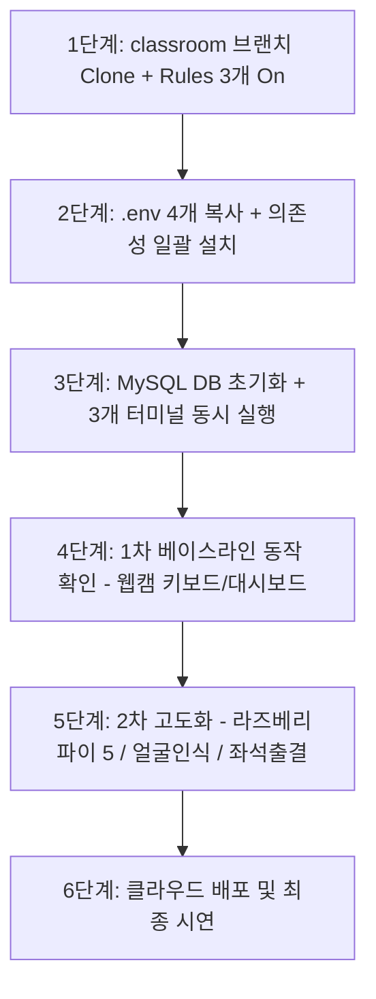

# 학생 수작업 로드맵 (2차 개발 체크리스트)

> 📂 **본편 02 / 팀 전원 / 수업 중 진행 체크용** · 전체 매뉴얼은 [01-학생용-설치-및-사용-매뉴얼](01-학생용-설치-및-사용-매뉴얼.md) · AI 프롬프트는 [03-2차-완성-가이드-및-AI-프롬프트-핸드북](03-2차-완성-가이드-및-AI-프롬프트-핸드북.md) · 전체 목록 [docs/README.md](README.md)

> AI에게 프롬프트로 시키지 않고 **학생이 직접 터미널/GUI/브라우저로 실행해야 하는 작업만** 모은 요약 체크리스트입니다.  
> 1차 완성본(`classroom` 브랜치)을 바탕으로 로컬 환경을 세팅하고 2차 고도화를 진행할 때 체크용으로 사용합니다.



---

## 1단계. 저장소 Clone 및 IDE 환경 설정 (팀당 1회)

- [ ] PowerShell에서 1차 완성 저장소(`classroom` 브랜치) 클론:
  ```powershell
  git clone -b classroom https://github.com/foxjini/agent-vibe-coding-starter-kit2.git iot-classroom
  cd iot-classroom
  ```
- [ ] Antigravity IDE에서 `iot-classroom` 폴더를 워크스페이스로 열기
- [ ] 상단 "…" 메뉴 → **Customizations** → **Rules**에서 **3개만 Always On**:
  - `karpathy-principles`
  - `security-rules`
  - `coding-standards`
  *(나머지 7개는 각 agent가 필요할 때 자동 로드하므로 Always On 금지 — 토큰 절약)*

---

## 2단계. 환경변수 준비 및 의존성 패키지 설치

- [ ] `.env.example` → `.env` 4개 복사:
  ```powershell
  copy backend\.env.example backend\.env
  copy frontend\.env.example frontend\.env
  copy vision\.env.example vision\.env
  copy pi\.env.example pi\.env
  ```
- [ ] `backend/.env`, `vision/.env`, `pi/.env`의 `DEVICE_API_KEY` 값을 팀 전용 고유 키(예: `classroom_secret_2026`)로 동일하게 설정
- [ ] **백엔드 venv 생성 및 패키지 설치**:
  ```powershell
  cd backend
  python -m venv venv
  .\venv\Scripts\Activate.ps1
  pip install -r requirements.txt
  cd ..
  ```
- [ ] **프론트엔드 패키지 설치**:
  ```powershell
  cd frontend
  npm install
  cd ..
  ```
- [ ] **비전 Python 3.12 venv 생성 및 패키지 설치**:
  ```powershell
  cd vision
  py -3.12 -m venv venv
  .\venv\Scripts\Activate.ps1
  pip install -r requirements.txt
  cd ..
  ```
  *(사전 포함된 `vision/yolov8n.pt` 가중치 확인 — 별도 다운로드 불필요)*

---

## 3단계. DB 초기화 및 1차 시스템 동시 구동 (멀티 터미널 3개)

- [ ] XAMPP Control Panel에서 **MySQL(MariaDB)** `Start`
- [ ] MariaDB 초기화 스크립트 실행 (10종 디바이스 시드 등록):
  ```powershell
  cd backend
  Get-Content db\init.sql | mysql -u root
  cd ..
  ```
  *(mysql 명령어가 없으면 phpMyAdmin `http://localhost/phpmyadmin` SQL 탭에서 `init.sql` 실행)*
- [ ] **[터미널 1: 백엔드 실행 유지]**:
  ```powershell
  cd backend
  .\venv\Scripts\Activate.ps1
  uvicorn main:app --reload --port 8000
  ```
  `http://localhost:8000/docs` 및 `/health` 정상 접속 확인
- [ ] **[터미널 2: 프론트엔드 대시보드 실행 유지]**:
  ```powershell
  cd frontend
  npm run dev
  ```
  `http://localhost:3000` 접속 후 `● 실시간 연결됨` 배지 및 6석 좌석 배치도 확인
- [ ] **[터미널 3: 비전 클라이언트 실행 유지]**:
  ```powershell
  cd vision
  .\venv\Scripts\Activate.ps1
  python main.py
  ```
  *(웹캠 충돌 방지: Zoom, Teams, 카메라 앱 등 사전 종료)*

---

## 4단계. 1차 베이스라인 동작 확인

- [ ] 비전 웹캠 창에 6개 좌석 ROI 박스가 정상 표시되는지 확인
- [ ] 웹캠 창 활성화 상태에서 숫자 `1`~`6` 키를 눌러 좌석 착석 토글 테스트
- [ ] 대시보드(`http://localhost:3000`)의 좌석 색상이 실시간으로 변경되는지 확인
- [ ] 대시보드에서 `servo_door`(자동문) '열기' 버튼 클릭 → 5초 후 자동으로 '닫힘' 복귀 확인
- [ ] Git 소스 제어 GUI(Ctrl+Shift+G)로 환경 세팅 완료 상태 커밋 (토큰 소모 0)

---

## 5단계. 2차 고도화 개발 (역할별 분담 진행)

> 💡 작업 시 **[`docs/03-2차-완성-가이드-및-AI-프롬프트-핸드북.md`](03-2차-완성-가이드-및-AI-프롬프트-핸드북.md)**의 치트시트 프롬프트를 복사하여 Antigravity에 전달하세요.

### [라즈베리파이 담당] 하드웨어 마이그레이션
- [ ] *(임시 테스트 시스템 경험 팀만)* **[`docs/부록B-iot-test-system-연동-가이드.md`](부록B-iot-test-system-연동-가이드.md)** 차이점 숙지
- [ ] **[`docs/부록A-백엔드-라즈베리파이5-연동-인터페이스-가이드.md`](부록A-백엔드-라즈베리파이5-연동-인터페이스-가이드.md)** 3장 REST 규격 확인
- [ ] Windows PC `ipconfig`로 IPv4 확인 후 `pi/.env`의 `BACKEND_URL` 수정
- [ ] 라즈베리파이 5 패키지 설치 (APT 패키지 `sudo apt install -y python3-gpiozero python3-lgpio` 후 `python3 -m venv --system-site-packages venv`, `pip install -r requirements.txt`)
- [ ] 교사 입회 하에 전원 OFF 상태에서 서보모터/LED/네오픽셀/부저/릴레이 배선
- [ ] 하드웨어 배선 1분 자가진단 실행 (`python test_hardware_gpio.py`)
- [ ] 라즈베리파이에서 `python main.py` (또는 `python 02_servo_door_daemon_mock.py`) 실행 (폴링 루프)
- [ ] `backend/.env`에서 `DEVICE_MODE=hardware` 전환 후 백엔드 재시작
- [ ] 대시보드 제어 및 웹캠 감지 시 실제 라즈베리파이 부품 물리 동작 확인

### [영상인식 담당] 실시간 얼굴인식 파이프라인
- [ ] ONNXRuntime ArcFace 또는 OpenCV DNN SFace 기반 얼굴 검출/식별 모듈 구성
- [ ] 학생 얼굴 등록 스크립트 작성 및 얼굴 임베딩 DB 저장
- [ ] 웹캠에서 등록된 학생 얼굴 식별 시 백엔드로 이벤트 전송 연동

### [백엔드·프론트 담당] 스마트 교실 통합 룰 및 UI 고도화
- [ ] 얼굴 인증 성공 시 자동문 5초 개방 + 좌석 안내 + 출석 상태 `PRESENT` 연동
- [ ] 교실 카메라 좌석 ROI 감지와 학생 선택 좌석 비교 판정 (`RESERVED` / `OCCUPIED` / `MISMATCH`)
- [ ] 재실 인원 기반 교실 조명(릴레이) 자동 ON/OFF 룰 구현
- [ ] 불꽃 센서 / 온습도 센서 위험 상황 알림 모달 및 부저 경보 연동

---

## 6단계. 클라우드 배포 및 최종 시연 점검

- [ ] Supabase 프로젝트 생성 및 마이그레이션 SQL 실행
- [ ] Render에 백엔드 Web Service 배포 및 환경변수 등록
- [ ] Vercel에 프론트엔드 배포 및 환경변수 등록
- [ ] 배포 URL에서 [얼굴인식 → 문 개방 → 좌석 착석 → 출결 갱신 → 센서 모니터링] 전체 시연 성공 확인
